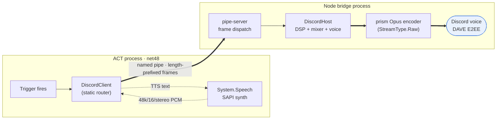
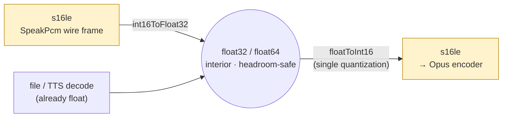
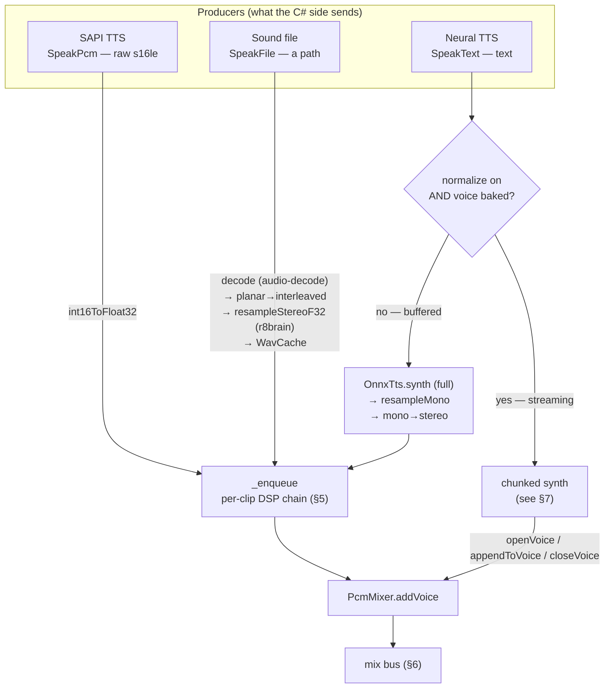
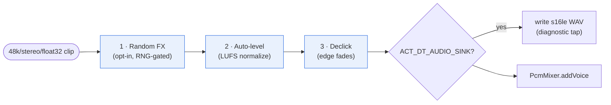
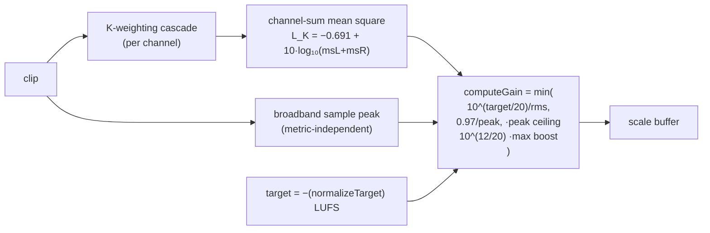
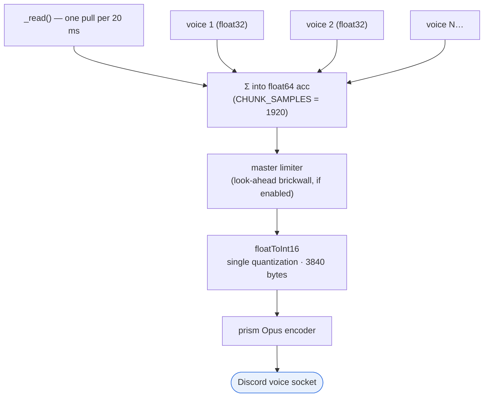
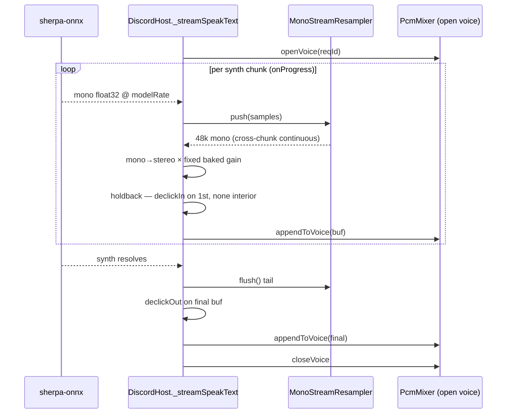

# The Audio Chain

A complete, end-to-end walk through every sample's journey — from a trigger
firing in ACT to Opus packets on the Discord voice socket. Written for
contributors and audio-engineer nerds who want to know *exactly* what happens to
the signal and where.

It is the **signal-flow reference**. For the ranked list of what's left to make
the realtime path pro-grade (dither, FX anti-aliasing, DC-blocking, …) see the
companion roadmap, [`AUDIO-PIPELINE.md`](AUDIO-PIPELINE.md). For the why-two-
processes architecture see [`CLAUDE.md`](../CLAUDE.md).

> **TL;DR.** Three producers (SAPI PCM, a sound file, neural-TTS text) become one
> internal currency — **48 kHz, stereo, interleaved float32** — pass a per-clip
> DSP chain (FX → loudness → declick), get summed in **float64** by a pull-based
> mixer, ride a **look-ahead brickwall limiter**, and are quantized to s16le
> **exactly once** before the Opus encoder. int16 exists only at the two edges.

---

## 1. The two processes

The plugin (net48, in ACT) can't open a Discord voice connection — DAVE E2EE
isn't available on .NET Framework. So all voice + DSP lives in a bundled Node
bridge, and the plugin is a thin **router**: it hands the bridge PCM, a file
path, or text and lets the bridge own every decode / DSP / mix / encode decision.

The wire is a Windows named pipe carrying little-endian length-prefixed frames
(JSON commands + one binary `SpeakPcm` frame kind). The plugin never touches a
sample after it leaves `DiscordClient`.

---

## 2. Format invariants (hard-wired)

Discord voice is **48 kHz / stereo** end-to-end and the Opus encoder input is
**16-bit signed PCM**. That rate/channel count is pinned in several places —
change them together, never bolt on a one-off conversion:

| Where | What it pins |
|---|---|
| `DiscordClient.formatInfo` | C# SAPI synth format = `SpeechAudioFormatInfo(48000, Sixteen, Stereo)` |
| `DiscordClient` PCM sends + `pipe-server.ts` check | `SpeakPcm` framed + validated as `48000/16/2` |
| `discord-host.ts` `TARGET_SAMPLE_RATE` + `StreamType.Raw` | resample target + raw-PCM input to the encoder |
| `resample.ts` `TARGET_SAMPLE_RATE` | r8brain output rate |
| `effects.ts` / `limiter.ts` / `k-weighting.ts` `SR` | DSP coefficient design rate |

**Sample format — the headroom discipline.** The whole interior pipeline works
in **interleaved float32 stereo** (`L,R,L,R,…`), nominal `[-1, 1]` but
*deliberately allowed to exceed it between stages* so headroom is preserved: an
echo train, a reverb tail, or a hot mix sum can momentarily run past full scale
and be pulled back down later instead of being clipped away mid-chain. int16
lives only at the **two edges**, both in `audio-format.ts`:

`floatToInt16` (round-to-nearest + hard clamp to `[-32768, 32767]`, scale
`32768`) is the pipeline's **single quantization point** and the natural future
home for TPDF dither. Every other stage keeps full float precision.

---

## 3. Three producers, one currency

Everything a trigger can play enters as one of three ops and is converted to the
48 k/stereo/float32 currency at ingest. After that the paths converge.

- **`SpeakPcm`** — the SAPI engine is synthesized *in the plugin* (`System.Speech`
  → 48 k/16/stereo) and shipped as a binary frame: an 11-byte header
  `[0x01][reqId u32][sampleRate u32][bits u8][channels u8]` + raw PCM. The bridge
  widens it to float once at the ingest edge.
- **`SpeakFile`** — the plugin sends only a path. The bridge reads + decodes
  (`audio-decode` handles wav/mp3/ogg/flac → planar float), interleaves to
  stereo, and band-limit resamples to 48 k via **r8brain** (`resampleStereoF32`).
  Decoded PCM is memoized in `WavCache` keyed by path+mtime, so a repeated
  trigger skips decode entirely. Input is bounded at 64 MiB (decode expands
  ~10× into float).
- **`SpeakText`** — neural TTS is synthesized *in the bridge* (sherpa-onnx). It
  splits into a **streaming** path (audio starts before synthesis finishes) and a
  **buffered** fallback; the choice hinges on whether leveling needs a
  whole-buffer scan — see §7.

---

## 4. r8brain resampling

Sample-rate conversion (file decode rate → 48 k; TTS model rate 22.05/24 k →
48 k) is done by **r8brain-wasm**, a polyphase windowed-sinc converter
(SINAD ~184–238 dB vs. the old linear interpolator's ~9–30 dB), so every clip is
band-limited and image-free rather than muffled-and-grainy.

| Entry point | Used by | Transition band | Note |
|---|---|---|---|
| `resampleStereoF32` | file path | `FILE_TRANSBAND = 2.0%` | one Resampler per channel; full passband, latency irrelevant (cached) |
| `resampleMono` | buffered TTS / probe | `2.0%` | single mono buffer |
| `MonoStreamResampler` | streaming TTS | `STREAM_TRANSBAND = 6.0%` | stateful; keeps cross-chunk continuity so concatenated output is sample-exact to a whole-buffer resample; wider band → ~18 ms first-output latency so live callouts start promptly |

The WASM module is instantiated **once at startup** (before `BRIDGE_READY`) and
JIT-warmed, so the first real callout pays no cold-start cost.

---

## 5. The per-clip DSP chain (`_enqueue`)

Every fully-buffered clip (both `Speak*` one-shot paths) runs the same three
transforms, in this order, before it becomes a mixer voice. The order is
deliberate.

**1 · Random FX** (`effects.ts`) — opt-in; the bridge rolls the dice from
`randomFx` + `fxChance` (0–100) and, on a hit, applies one randomly-chosen effect
from `echo, reverb, flanger, chorus, tremolo, distortion, muffle, pitch`. Pure
float math; output may run past ±1 (the clamp is deferred to the exit). **Skipped
for all TTS** (`skipFx`) — a spoken callout shouldn't randomly distort, and FX
would block the streaming path.

**2 · Auto-level** (`normalize.ts`) — runs *after* FX, so the effect's own level
change is what gets corrected (a distortion hit that came out hot, an echo tail
that dropped the average → both land near target). Loudness is measured with
**ITU-R BS.1770 K-weighting (LUFS)**; details in §5.1.

**3 · Declick** (`declick.ts`) — runs *last*, so the final samples reach zero
whatever FX/normalize did to the level. A clip that starts/ends on a non-zero
sample steps against the mixer's digital silence, and that one-sample
discontinuity is an audible click once Opus encodes it. Fades:

- **fade-in** `FADE_IN_FRAMES = 96` (2 ms) — short, to preserve percussive attack.
- **fade-out** `FADE_OUT_FRAMES = 240` (5 ms) — a tail is decaying anyway.

Returns a **new** array (never mutates — callers may hold `WavCache`-shared
buffers). The streaming path declicks only the silence-facing edges (`declickIn`
on the first chunk, `declickOut` on the last); interior chunk joins are contiguous
synth samples and need no ramp.

### 5.1 Loudness & leveling (LUFS)

Auto-level brings every clip toward one target loudness so the user isn't riding
the volume knob between callouts. It is **per-clip and offline** — the whole
buffer is in hand, so there's no streaming compressor; just measure, pick one
gain, apply it.

- **K-weighting** (`k-weighting.ts`) is a two-biquad cascade per channel — a
  high-shelf "head" filter + a ~38 Hz RLB high-pass — then a channel-summed mean
  square with the −0.691 LUFS offset. Ungated (no 400 ms-block / −70/−10 LU
  gating): each short trigger is one coherent gain decision. It tracks *perceived*
  loudness across spectra far better than broadband energy — a bass-heavy SFX and
  a speech callout that read equally loud also *sound* equally loud.
- `measureLevel` returns the loudness as a **linear full-scale-equivalent whose
  dB value is the LUFS** (`rms = dbToLinear(L_K)`), so `computeGain`'s
  `dbToLinear(target)/rms` lands the clip on the LUFS target with **zero** extra
  conversion. `peak` stays the broadband sample peak — the clip-safety ceiling.
- The gain is bounded by **two limiters**: the peak ceiling
  `PEAK_CEILING/peak` (`0.97` ≈ −0.26 dBFS — a boost can never clip) and the
  max-boost cap `MAX_BOOST_DB = 12` (never amplify near-silence/hiss). Buffers
  under `MIN_RMS` (1 LSB) are treated as silence and left untouched; a gain within
  `UNITY_EPSILON` (0.01 ≈ 0.086 dB) of 1 skips the rewrite.
- The user-facing target is a **positive magnitude negated** to a LUFS target
  (default `17` → −17 LUFS; range 9..27 → −9..−27 LUFS).

**Baked loudness for streaming TTS.** Per-voice loudness is pre-measured into
`onnx-voices.json` (`rmsDbfs` = LUFS, `peakDbfs` = broadband peak) using the exact
runtime metric. The streaming synth path folds that into **one fixed gain** for
the whole utterance (`computeGain(baked.rms, safePeak, target)`) instead of
scanning the buffer — which is what lets it stream. The baked peak is inflated by
`STREAM_PEAK_SAFETY_DB = 3` (capped at full scale) before deriving the gain, so a
runtime callout louder than the offline probe max can't be boosted into a clip.

---

## 6. The mix bus

`PcmMixer` is a `Readable` that Discord pulls one 20 ms chunk from at a time. It
sums any number of active voices, so **overlapping triggers play together** (a
single long-lived `AudioResource` is fed by the mixer for the whole session — it
never `push(null)`s; idle = silence).

Chunk geometry: `FRAME_SAMPLES = 960` per channel (20 ms @ 48 k), `CHANNELS = 2`
→ `CHUNK_SAMPLES = 1920` float samples → `CHUNK_BYTES = 3840` int16 output (one
Opus frame per `_read`, which keeps the encoder fed). Voices are summed in
**float64** for headroom; the sum is quantized to s16le **once** at the output.

**Backpressure & lifetime.** Worst-case memory is bounded: `MAX_VOICES = 64`,
`MAX_QUEUED_BYTES = 64 MiB`, FIFO eviction (drop oldest) — but the *only* voice
is never evicted, and an **open streaming voice is pinned** (yanking it mid-stream
would cut a callout). A mix error emits silence rather than tearing down the
resource.

### 6.1 Master limiter

Per-clip normalize bounds each clip alone, but **N overlapping clips sum past full
scale**, and without a bus stage the sum hard-clips at the int16 edge — the
harshest artifact in the chain, exactly during overlap. `LookaheadLimiter` rides
those summed peaks down to a true-peak-safe ceiling smoothly instead.

- **Look-ahead, channel-linked, brickwall.** Output is delayed by
  `LOOKAHEAD_FRAMES = 96` (2 ms); the detector is a running **minimum** of the
  required gain over that same window (an O(1) monotonic min-deque), so the gain
  is already pulled down by the time a peak reaches the output — no transient
  slips through, no stereo-image shift (same gain hits L+R).
- **Linear attack** (reaches any target within the window) + **exponential
  release** (`RELEASE_MS = 100`, smooth, no pumping).
- **True-peak via headroom, not oversampling.** The bus feeds a lossy Opus
  encoder that reshapes peaks downstream, so an exact inter-sample guarantee at
  the encoder input would be undone anyway. The ceiling sits a touch under
  0 dBFS — `LIMITER_CEILINGS_DB = [-0.5, -1, -2, -3]` dBTP, default index 1 =
  **−1 dBTP** ≈ linear 0.891 — and that margin absorbs typical inter-sample
  overshoot at zero cost.
- It is **independent of normalize** (catches inter-voice sum clipping even with
  leveling off) and **bypassed on a bare mixer** (a look-ahead limiter delays even
  at unity gain, so an unconfigured mixer stays a delay-free pure summing bus; the
  unit tests rely on that). `discord-host` arms it from the live config on join +
  on change. `floatToInt16`'s clamp remains the absolute backstop.

---

## 7. Streaming neural TTS

`SpeakText` picks streaming whenever leveling needs no whole-buffer scan — i.e.
`normalize` is off, **or** the voice is baked (all catalog voices are). The rare
unmeasured-voice + normalize case falls back to buffered synthesis. Streaming
means audio starts after the **first** synth chunk, not the whole utterance.

Key mechanics:

- **One fixed gain** for the whole utterance (from the baked level + target), so
  no per-chunk measurement — this is what makes streaming compatible with
  leveling.
- **Cross-chunk resampler continuity** — `MonoStreamResampler` carries r8brain
  state across `push()` calls, so concatenated output is sample-exact to a
  whole-buffer resample (no per-chunk boundary artifacts).
- **One-chunk holdback for declick** — the host always holds the last emitted
  buffer so it knows which chunk is *final* (gets `declickOut`); the first gets
  `declickIn`; interior chunks are contiguous and unramped. A mid-utterance synth
  throw still ends cleanly (the tail was already fade-held) and is reported as a
  *played partial* rather than a hard failure.
- The complete utterance is also concatenated and written to the WAV sink as one
  file when `ACT_DT_AUDIO_SINK` is set.

---

## 8. Opus & delivery

`StreamType.Raw` makes `@discordjs/voice` insert a **prism-media Opus encoder**
and expose it as `resource.encoder`. The bridge holds that encoder and sets its
bitrate from the audio-quality tier — `AUDIO_QUALITY_BITRATES = [48000, 96000,
128000]` by `audioQualityIndex` — on join and on every config change (bitrate is
an encoder CTL, so retuning never touches the wire contract). 128 kbps needs a
Discord channel that supports it (a boosted server). Encrypted frames go out over
DAVE.

---

## 9. Numeric reference

Every constant that shapes the sound, in one place.

| Constant | Value | Where | Meaning |
|---|---|---|---|
| Sample rate | 48000 Hz | everywhere | Discord-fixed |
| Channels | 2 (stereo) | everywhere | Discord-fixed |
| Mix frame | 960 samples/ch · 20 ms | `pcm-mixer.ts` | one Opus frame per `_read` |
| Mix chunk | 1920 float / 3840 int16 B | `pcm-mixer.ts` | per pull |
| int16 scale | 32768 | `audio-format.ts` | 1.0 == 0 dBFS; clamp `[-32768, 32767]` |
| Peak ceiling | 0.97 (≈ −0.26 dBFS) | `normalize.ts` | boost-safety brickwall |
| Max boost | 12 dB | `normalize.ts` | don't amplify near-silence |
| Min RMS | 1/32768 (1 LSB) | `normalize.ts` | silence gate |
| Unity epsilon | 0.01 (≈ 0.086 dB) | `normalize.ts` | skip sub-perceptual rewrites |
| LUFS offset | −0.691 | `k-weighting.ts` | BS.1770 absolute calibration |
| K HPF corner | ~38 Hz | `k-weighting.ts` | RLB stage-2 high-pass |
| Default target | 17 → −17 LUFS | `PluginSettings` / `protocol.ts` | range 9..27 |
| Stream peak safety | 3 dB | `discord-host.ts` | headroom over baked peak |
| Fade-in | 96 frames · 2 ms | `declick.ts` | onset declick |
| Fade-out | 240 frames · 5 ms | `declick.ts` | tail declick |
| Limiter look-ahead | 96 frames · 2 ms | `limiter.ts` | = attack window |
| Limiter release | 100 ms | `limiter.ts` | exp recovery |
| Limiter ceilings | −0.5 / −1 / −2 / −3 dBTP | `discord-host.ts` | default index 1 = −1 |
| Opus bitrates | 48 / 96 / 128 kbps | `discord-host.ts` | by quality tier |
| File transition band | 2.0% | `resample.ts` | tight, cached path |
| Stream transition band | 6.0% | `resample.ts` | ~18 ms first-output latency |
| Max decode input | 64 MiB | `discord-host.ts` | pre-decode guard |
| Max voices / queue | 64 / 64 MiB | `pcm-mixer.ts` | FIFO evict (open pinned) |

### Latency contributors (realtime path)

| Source | Added latency |
|---|---|
| Streaming resampler first output | ~18 ms |
| Master limiter look-ahead | 2 ms |
| Opus framing | 20 ms (one frame) |
| Discord voice RTT | network (logged as `ws`/`udp` ping) |

The look-ahead and resampler latencies are negligible next to Discord voice RTT
and the fixed 20 ms Opus framing.

---

## 10. File map

| File | Role in the chain |
|---|---|
| `ACT_DiscordTriggers.Core/Ipc/DiscordClient.cs` | C# router; SAPI synth → `SpeakPcm`; `SpeakFile`/`SpeakText` routing |
| `src/pipe-server.ts` | frame framing/dispatch; `SpeakPcm` `48000/16/2` validation |
| `src/discord-host.ts` | orchestration: ingest, `_enqueue` chain, streaming TTS, voice/encoder/limiter config |
| `src/audio-format.ts` | the two int16↔float edges (single quantization point) |
| `src/resample.ts` | r8brain SRC (stereo / mono / streaming) |
| `src/effects.ts` | random FX catalog |
| `src/normalize.ts` | LUFS auto-level (`measureLevel` / `computeGain` / `normalize`) |
| `src/k-weighting.ts` | ITU-R BS.1770 K-weighting cascade |
| `src/declick.ts` | edge fades (`declick` / `declickIn` / `declickOut`) |
| `src/pcm-mixer.ts` | pull-based float64 summing bus + single int16 exit |
| `src/limiter.ts` | master look-ahead brickwall limiter |
| `Core/Tts/onnx-voices.json` | baked per-voice LUFS + peak (streaming fixed-gain) |

---

*Keep this doc honest: it describes the chain as it is. When a stage changes,
update the diagram and the numeric table here, and the format-invariant list in
[`AUDIO-PIPELINE.md`](AUDIO-PIPELINE.md).*
